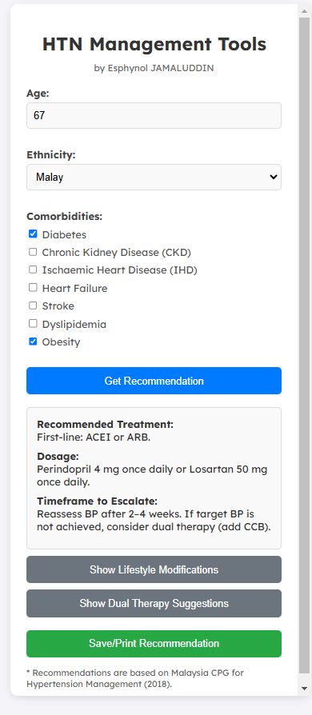

# HTN Management Tools

## Overview
The **HTN Management Tools** is a web-based application designed to assist healthcare professionals in managing hypertension (HTN) by providing personalized treatment recommendations based on patient demographics and comorbidities. The tool adheres to the **Malaysia Clinical Practice Guidelines (CPG) for Hypertension Management (2018)**.

 <!-- Add a screenshot later -->

## Features
- **Personalized Recommendations**: Provides first-line drug recommendations, dosages, and timeframes for therapy escalation based on patient age, ethnicity, and comorbidities.
- **Lifestyle Modifications**: Offers evidence-based lifestyle advice to complement pharmacological treatment.
- **Dual Therapy Suggestions**: Recommends dual therapy options if target blood pressure is not achieved with initial treatment.
- **Save/Print Functionality**: Allows users to save or print the recommendations for patient records or further reference.

## How to Use
1. **Enter Patient Information**:
   - Input the patient's **age**.
   - Select the patient's **ethnicity** from the dropdown menu.
   - Check all applicable **comorbidities** (e.g., Diabetes, CKD, IHD, etc.).

2. **Get Recommendations**:
   - Click the **"Get Recommendation"** button to generate personalized treatment advice.

3. **View Additional Advice**:
   - Click **"Show Lifestyle Modifications"** to view lifestyle advice.
   - Click **"Show Dual Therapy Suggestions"** to view recommendations for dual therapy.

4. **Save or Print**:
   - Click the **"Save/Print Recommendation"** button to save or print the results.

## Recommendations Based On
- **Age**: Different recommendations for patients under 55 and those 55 or older.
- **Ethnicity**: Tailored recommendations for Malay, Chinese, Indian, Indigenous, and other ethnicities.
- **Comorbidities**: Priority given to conditions like Heart Failure, IHD, Diabetes, CKD, Stroke, Dyslipidemia, and Obesity.

## Example Recommendations
- **First-line Drug**: ACEI/ARB, CCB, Beta-blocker, or Thiazide Diuretic, depending on patient profile.
- **Dosage**: Specific dosages for recommended medications.
- **Timeframe to Escalate**: Guidance on when to reassess and escalate therapy.
- **Lifestyle Advice**: Salt reduction, exercise, weight management, and more.
- **Dual Therapy**: Suggestions for combining medications if needed.

## Technologies Used
- **HTML5**: Structure of the web application.
- **CSS3**: Styling and responsive design.
- **JavaScript**: Logic for generating recommendations and interactive features.
- **Google Fonts**: Lexend font for improved readability.

## Disclaimer
This tool is intended for use by healthcare professionals and is based on the **Malaysia CPG for Hypertension Management (2018)**. It is not a substitute for clinical judgment or professional medical advice. Always consider individual patient circumstances and consult relevant guidelines when making treatment decisions.

## Author
**Esphynol JAMALUDDIN**

## License
This project is open-source and available for educational and non-commercial use. For commercial use or modifications, please contact the author.

---

For any questions or feedback, please reach out to the author. Thank you for using the **HTN Management Tools**!
